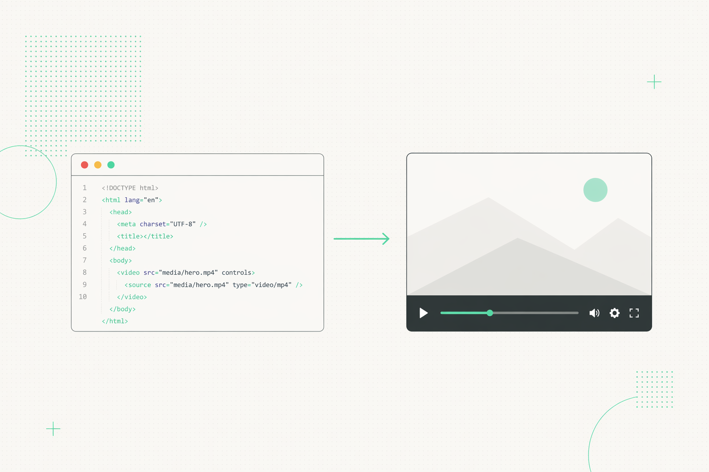

# html-video

> **The agent-native, multi-engine HTML→Video meta-layer.** Connect any local coding agent (Claude Code · Cursor · Codex · Hermes · the Anthropic API) and it turns a prompt — or a pasted article / GitHub repo — into a multi-frame video. One agent loop, pluggable rendering engines, a curated template gallery, optional AI soundtrack. Apache-2.0, no per-render fees.

<p align="center">
  
</p>

<p align="center">
  <a href="LICENSE"></a>
  <a href="#supported-agents"></a>
  <a href="#template-gallery"></a>
  <a href="#from-a-link-or-repo"></a>
  <a href="#quick-start"></a>
</p>

<!-- Built by the team behind Open Design — these badges link to its community on purpose. -->
<p align="center">
  <a href="https://github.com/nexu-io/open-design#community"></a>
  <a href="https://x.com/nexudotio"></a>
  <a href="https://github.com/nexu-io/open-design"></a>
</p>

<p align="center"><b>English</b> · <a href="README.zh-CN.md">简体中文</a></p>

---

## Why html-video

HTML→Video is a real category — but every engine is opinionated, and each one wants you to learn *its* authoring model:

| Engine | Paradigm | Tradeoff |
|---|---|---|
| [Hyperframes](https://github.com/heygen-com/hyperframes) | HTML + CSS + GSAP, agent-skill driven | Single rendering paradigm |
| [Remotion](https://www.remotion.dev/) | React components | Source-available, paid above 4 devs |
| [Motion Canvas](https://github.com/motion-canvas/motion-canvas) · [Revideo](https://github.com/redotvideo/revideo) | TypeScript generators on canvas | Best for explainers, code-first |
| [Manim](https://github.com/3b1b/manim) and friends | Math / 3D first | Niche |

Picking the right engine per use case, learning each model, and stitching them into one workflow costs real engineering time. Most teams pick one and live with its limits.

**html-video is the meta-layer that sits above all of them:**

- **Agent-native by default** — bring a local coding-agent CLI (or the Anthropic API); it drives the whole loop. No new DSL to learn — you talk to your agent.
- **Multi-engine** — Hyperframes, Remotion, Motion Canvas, Revideo as pluggable backends. New engines drop in as adapters; your content doesn't change.
- **Template gallery** — 15 curated, reusable patterns (data viz, product demos, social shorts, explainers, kinetic type, transitions) that preview live in the studio.
- **Apache-2.0** — no per-render fees, no seat caps, no contributor agreements.

## What you get

| | |
|---|---|
| **Studio** | A local browser studio (`html-video studio`) — chat to generate, a live template gallery, per-frame text editing, multi-frame storyboards, MP4 export. |
| **Supported agents** | Claude Code, Cursor Agent, Codex CLI, Hermes, and the Anthropic Messages API (BYOK) — auto-detected on your `PATH`, switchable from the top bar. |
| **From a link or repo** | Paste an article URL (incl. WeChat articles) or a GitHub repo — the studio fetches it server-side and builds the video from the actual content. |
| **Soundtrack** | Optional AI background music + narration via MiniMax, mixed into the exported MP4 (configure your key in Settings → Audio). |
| **Engines** | Hyperframes reference adapter today; Remotion / Motion Canvas / Revideo adapters on the roadmap. |

## Quick start

```bash
pnpm install
pnpm -r build
node packages/cli/dist/bin.js studio    # opens the studio on http://127.0.0.1:3071
```

Then in the studio: pick a template (or just describe a video / paste a link), chat with your agent, and export.

CLI utilities:

```bash
node packages/cli/dist/bin.js doctor                 # detect installed agents + engines
node packages/cli/dist/bin.js search-templates --intent "github stars race" --top 3
```

## Supported agents

Auto-detected on your `PATH`; switch the active one from the studio's top bar.

| Agent | How it runs |
|---|---|
| **Claude Code** | `claude --print`, prompt via stdin |
| **Cursor Agent** | `cursor-agent --print` |
| **Codex CLI** | `codex exec`, prompt via stdin |
| **Hermes** | Hermes ACP CLI |
| **Anthropic API** | Direct Messages API (BYOK) — the default when no CLI is pinned |

## From a link or repo

Paste a link in the chat and html-video fetches it for you (the agents themselves have no network access, so the studio fetches server-side and feeds the content into the prompt):

- **Web article** → fetched and flattened to Markdown (handles server-rendered pages like WeChat 公众号 articles).
- **GitHub repo** → description, top-level structure, and README pulled via the public API.

The fetched content becomes the source material the video is built from — no need to retype anything.

## Template gallery

15 templates ship in `templates/`, spanning explainers, data viz (NYT-style charts), product promos, kinetic type, Swiss-grid layouts, glitch titles, and outros. Multi-composition templates render live in the studio gallery via a built-in composition player, so you see the real motion before applying one.

## Architecture

```
packages/
├── core/                  Project / Asset / ContentGraph types, registries, orchestrator, MiniMax + ffmpeg mux
├── content-graph/         Multi-frame storyboard IR (nodes + edges, topo-sort)
├── runtime/               Agent runtime — detect / spawn / stream (Claude, Cursor, Codex, Hermes, Anthropic API)
├── adapter-hyperframes/   First reference engine adapter (HTML + CSS + GSAP)
├── cli/                   `html-video` command + the studio HTTP server
└── project-studio/        Browser studio UI (chat, template gallery, frames, soundtrack, export)
templates/                 15 curated video templates
research/                  RFCs (engine adapter / template metadata / agent skill / content-graph)
```

## Roadmap

1. ✅ Engine adapter spec — one interface, N backends
2. ✅ Template metadata format — license-first, agent-readable
3. ✅ Multi-frame storyboard workflow (content-graph) — prompt → frames → review → MP4
4. ✅ Studio: live template gallery, agent switcher, per-frame text editing
5. ✅ Source material: article / GitHub-repo → video
6. ✅ AI soundtrack (MiniMax music + narration), mixed at export
7. ⏳ Real Hyperframes upstream render (replace the adapter stub)
8. ⏳ Adapters for Remotion / Motion Canvas / Revideo
9. ⏳ Agent skill packages + a template marketplace

## License

[Apache-2.0](LICENSE)

## Built by

[nexu-io](https://github.com/nexu-io) — the same team behind [Open Design](https://github.com/nexu-io/open-design) and [HTML Anything](https://github.com/nexu-io/html-anything). Join the [Discord](https://github.com/nexu-io/open-design#community).
